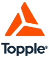

# k8s-for-users-intro

Most people know Kubernetes as a container or service orchestration and resiliency platform. These exercises will help you work through those specific Kubernetes features and the related resources. 

This morning you're going to learn with a classic Docker example application. The voting app uses a microservice architecture with four services written in different languages, and two databases (Redis and Postgres). Two services, `vote` and `result` serve web pages that allow visitors to vote and view polling results respectively. A third service is a Redis pub-sub worker that digests voting messages and updates a table in Postgres.

The following exercises will walk you through Kubernetes as a database and then service deployment and life cycle management using Kubernetes resources and declarative workflows.

If you're not familiar with YAML then you might want to pull up this [YAML Primer](../YAML_Primer.md) in another tab.

## Activities

1. [Kubernetes is a Database First](./database.md)
2. [Introducing Workload Resources](./workload.md)
3. [Kubernetes Event-Based Automation](./automation.md)

## Give Me More

If you enjoyed this micro-workshop please [reach out](https://www.gotopple.com) and ask about our multi-day workshops on Kubernetes, Docker, Swarm, API Design, and soft skills like interviewing best-practices. 

## Copyright

2018 [Topple](https://www.gotopple.com)

